# <!-- {docsify-ignore} -->

# Getting started

To start using the tool first you need to create a "Better rule tile container" asset. This asset is the core of the tool. Everything you do will be saved into this container asset, therefore you must create one before you start doing anything else.<br>
To create an asset, right click in the project window, and navigate to: **Create -> 2D -> Tiles -> Better Rule Tile Container**, and click on it.

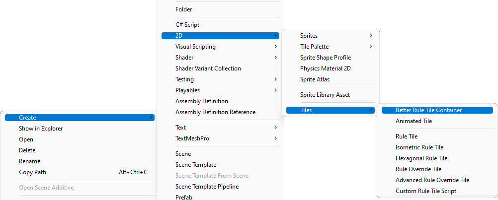

<br>

# Opening the editor

After you've created a "Better rule tile container" asset, you can open the editor by **double clicking the asset**, or by **pressing open in the inspector** when the asset is selected. 

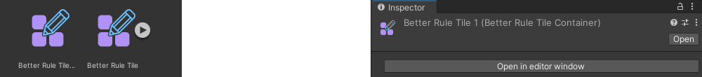

If you have multiple container assets, each asset will open in it's own editor window. If the asset is already open in an editor, opening the asset will bring that editor window in front.<br>
Deleting a container asset will close the editor window editing that asset.

> *Note that you shouldn't edit this asset directly, but only through the editor to avoid errors. Only edit the asset directly for debugging purposes!*

<br>

# The rule tile editor

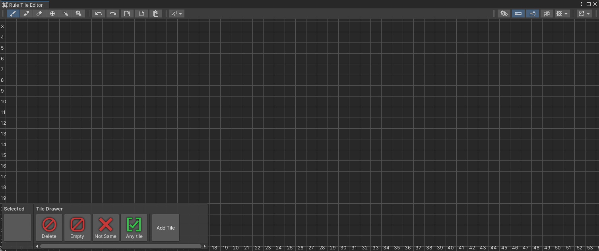

When you open a new file you'll see this window. It has 4 main parts:
- The **grid**,
- The **toolbar** and **editor actions** in the top left corner,
- The **tile drawer** in the botton left corner, and
- The **editor settings** and **export options** in the top right corner.

## The grid

There are 3 different types of grids you can work in: **square**, **isometric** and **hexagonal**, with hexagonal having two different orientations: **pointed topped** and **flat topped**. You can change the grid type in the **export options** dropdown, in the top right corner. You can furthermore customize the grid's scaling in the **other settings** dropdown, which you can find right next to the export options.

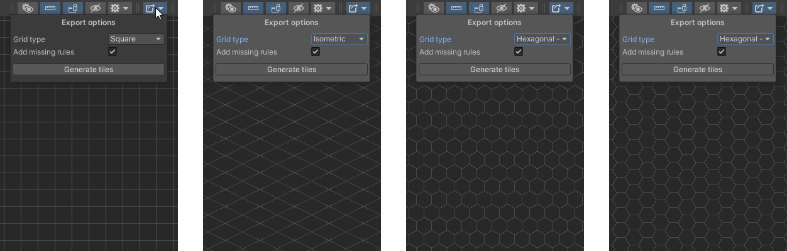

> *Note, it's best to change the grid type before you start working on anything, to avoid displacement of the grid due to the different coordinate systems.*

## The editor settings

There are a few settings you can tweak to help you in the editor:
- **Highlight modified cells** - When this option is enabled it highlights grid cells with a flashing outline, which have been modified in the **inspector window**.
- **Show ruler** - When enabled, it shows a ruler on the bottom and left side of the window, to help orient yourself on the grid.

> Note, the ruler only shows the actual coordinates when the grid is set to square, in other grids, it only serves as a way to orient yourself on the grid.

- **Lock windows** - If this option is enabled all of the floating windows will be locked to either corners of the editor. If you disable this option you can freely drag the floating windows anywhere inside the editor. If the windows disapper after resizing the editor, you can enable this option to bring those windows back.
- **Hide sprites** - When this option is enabled, it will hide the **sprite layer**. This option can be used to check if there's a tile under a sprite or not.


There are even more settings in the **other settings** dropdown, which you can open by clicking the corresponding button. This dropdown has a few settings inside:
- **Drawer size** - Determines the size of the **tile drawer**.
- **Current zoom** - Here you can manually enter the current zoom amount of the grid. The larger the zoom amount the larger the grid cells appear. You can also **use your mouse scrool wheel to zoom in and out**, so this option was mostly intended to input more specific values.
- **Render small grid** - If this option is disabled, zooming far out will cause the grid lines to disappear. This option is most useful when working in a **hexagonal grid**, as the grid is not all straight lines, rendering a large small grid could be quite resource intensive.
- **Zoom treshold** - This value determines when should the grid disapper when the **render small grid** option is disabled. The grid will stop rendering if the current zoom value is less than the zoom treshold.
- **Grid size** - Determines how large should the grid be when the **current zoom** value is one.
- **Grid cell offset** - You can change this option if your sprites don't line up with the grid lines.

And finally, under the **export options** you can change settings regarding how should the final rule tiles be generated:
- **Grid tyle** - The shape of the [grid](./better-rule-tiles/get-started?id=the-grid).
- **Add missing rules** - When this option is enabled, the missing rules in [tile variations](./better-rule-tiles/tile-creation?id=unique-tiles-and-tile-variations) will be filled in from the [parent tile](./better-rule-tiles/tile-creation?id=unique-tiles-and-tile-variations).
- **Simplify similar rules** - If this option is enabled, when generating the tiles it checks which tiles which have the same sprite, finds a common pattern between them and replaces them with one rule that applies for all. For example:

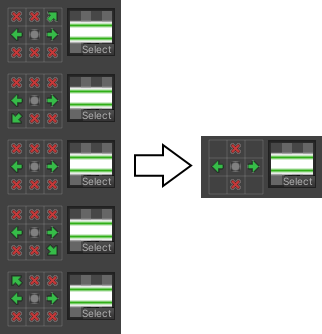

## The tile drawer

This window allows you to select and create tiles, and also shows you a preview of the currently selected tile or sprite. Besides the tiles you create, there are a few default **rules** in this drawer you can use to spicify how tiles should behave. These default tiles/rules are:
- **Delete** - Basically the eraser brush of the **tile layer**, you can use this tile with the **brush tool** to delete tiles on the grid.
- **Empty** - When this tile is placed, the rule in this place will be true when there's no tile placed there.
- **Not same** - When this tile is placed, the rule in this place will be true when it's not the same tile as the one we're comparing it to.
- **Any** - When this tile is placed, the rule in this place will be true when there's any tile placed there.

For a more detailed explanation on how rules work go to the [rules](./better-rule-tiles/rules) page.

## The toolbar

It is located in the top left corner of the editor, the toolbar contains all of the brushes, tools and actions you can use to edit tiles on the grid. The toolbar has 3 different sections: the **toolbar** itself, where you can pick the tools to edit the grid; **actions** like undo, redo, copy and paste; and **special actions**

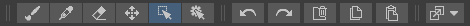

### Toolbar

- **Brush (B)** - with the brush tool you can draw on the grid with the currently **selected tile/sprite**. You can select a tile in the tile drawer, or you can pick a sprite from the grid using ther **picker tool**. If you don't have any sprites on the grid you need to [add sprites](./better-rule-tiles/tile-creation?id=adding-sprites-to-the-grid) to the grid first. 

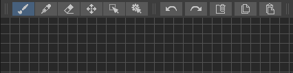

- **Picker tool (I)** - with this tool you can pick a sprite or a tile to set as the currently **selected tile/sprite**. If there's a sprite over the tile, the sprite is gonna get selected, of you click on a tile without a sprite it will select the tile.

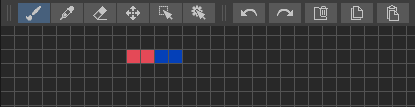

- **Eraser (F)** - with the eraser you can delete **sprites** from the grid by clicking on them or dragging over them while the tool is selected. With this tool you can only delete sprites, to delete tiles you need to use the **brush tool** together with the **delete tile**.

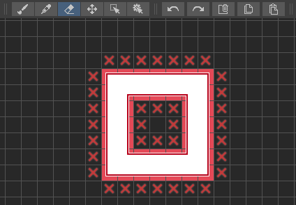

- **Move tool (M)** - with this tool you can move the tiles  around the grid that you've selected with the **selection tool**.
- **Selection tool (S)** - with this tool you can select one or multiple tiles. This tool is used together with other tools to edit a certain section in the grid.

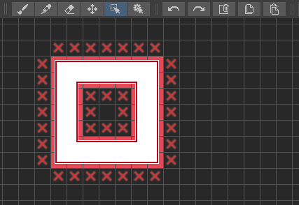

- **Tile inspector (E)** - using this tool you can change how individual [tiling rules](./better-rule-tiles/tile-creation?id=setting-tiling-rules) behave. You can read more about the **tile inspector** by going [here](./better-rule-tiles/tile-creation?id=individual-tiling-rule-settings).

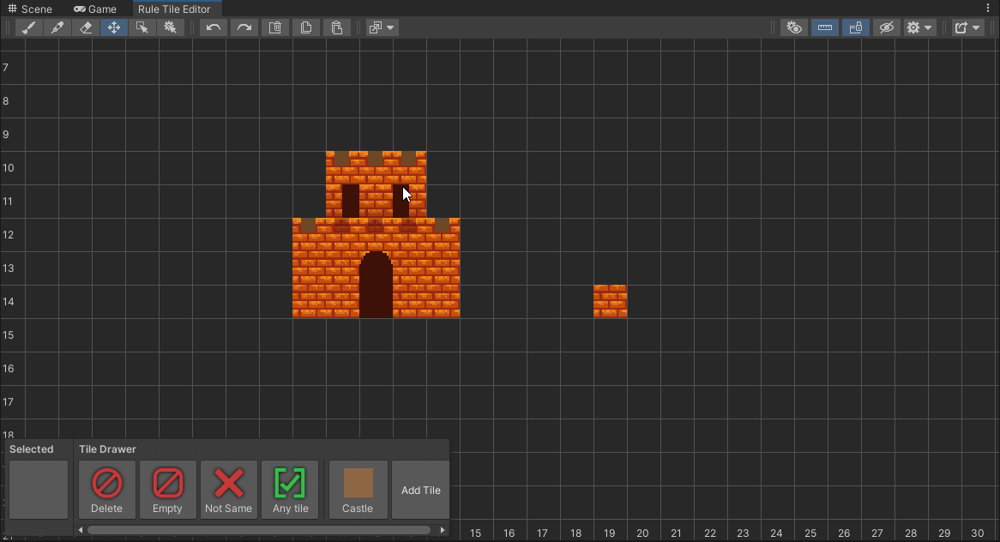

### Actions

- **Undo (Ctrl + Z)** - Undoes your last action.
- **Redo (Ctrl + Y)** - Redoes your last action.
- **Delete selection (Delete)** - Deletes the **currently selected area**.
- **Copy (Ctrl + C)** - Copies ther **currently selected area**.
- **Paste (Ctrl + V)** - Pastes the copied selection in. Pressing paste will show a preview of the area which you can move around. After you're ready to paste the selection in you can press **escape** or switch tools to confirm the action. You can press **delete** to cancel the action.

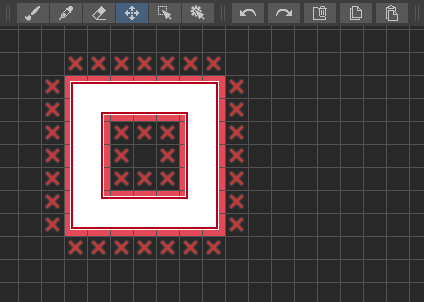

### Special tools

- **Replace selection** - this tool enables you to **replace tiles and sprites** to different ones in the **currently selected area**. When replacing tiles, it just finds every x type of tile and replaces it with the tile you specified. When replacing sprites, it looks at the file name, finds the section which matches with the string you specified, and replaces that section to the new string. I.e. 

    ```
    Replace from = "Green"
    Replace to = "Purple"
    File = "Green_Grass" => "Purple_Grass"
    ```
    
    A matching file will be searched in the asset database, and if the tool found a matching file it will replace it. If there's no matching tile nothing will happen.

> Note that this string is case sensitive! "Green" != "green"

> Note that the images have to be in the same folder!

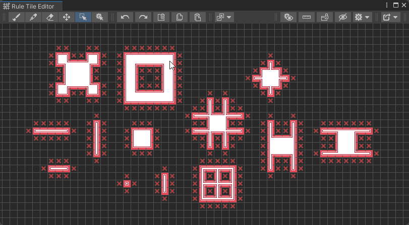