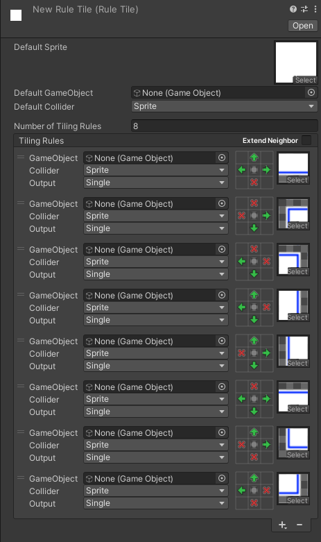

#  <!-- {docsify-ignore} -->

# Introduction to rule tiles

Rule tiles in unity are a better way to paint tiles to a grid. When using just regular tiles you need to place every edge and corner manually, which can be really time consuming. Rule tiles adapt to their surroundings, and set the edges/corners according to the rules you specified.

When selecting a new rule tile in the inspector, you can see a list of **tiling rules**. This is where you can add as many rules as there are tiles in the tileset. If there is a tile image for which you don’t wish to create a rule, simply exclude it.

You can add **tiling rules** by clicking the **+** button. A **tiling rule** has the same options as a default tile, with one exception: you can specify in the small **grids** when should this tile be placed.

When the grid cell shows a **green arrow** (the rule is set to **this**), the tile is continuous. If you set that place to a **red X** (the rule **not this**), there's no tile in that position.

When placing down the tile it will check all **tiling rules** from top to bottom. If all the places match with the rules we specified, that **tiling rule** will show on our tilemap. If at least one of the specified rules do not match with the tiles' surroundings, it will skip to the next **tiling rule**. If none if the tiling rules match the defaults will be used. 

For more information about rule tiles, you can visit the official article on [how to use rule tiles](https://learn.unity.com/tutorial/using-rule-tiles).

# Regular vs Better rule tiles

Rule tiles are a good way to speed up your workflow with tiles, **but it lacks a few features** which would be useful in quite a lot of scenarios:

- Rule tiles can only interact with themselves, and not with each other. So if you want specific interactions between two tiles it's not possible.
- You can only check if the neighbor is the same tile or not, you cannot check for empty spaces or other tiles.
- You can also not set custom variables or properties for the tile.

Of course, all these problems can be fixed by creating a **custom scripted rule tile**, but it's not the simplest and most straight forward thing to achieve. **Better rule tiles** can fix all of these problems, and also add a number of quality of life features too:

- 
- 