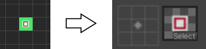

#  <!-- {docsify-ignore} -->

# Introduction to rule tiles

Rule tiles in unity are a better way to paint tiles to a grid. When using just regular tiles you need to place every edge and corner manually, which can be really time consuming. Rule tiles adapt to their surroundings, and set the edges/corners according to the rules you specified.

When selecting a new rule tile in the inspector, you can see a list of **tiling rules**. This is where you can add as many rules as there are tiles in the tileset. If there is a tile image for which you don’t wish to create a rule, simply exclude it.

You can add **tiling rules** by clicking the **+** button. A **tiling rule** has the same options as a default tile, with one exception: you can specify in the small **grids** when should this tile be placed.

When the grid cell shows a **green arrow** (the rule is set to **this**), the tile is continuous. If you set that place to a **red X** (the rule **not this**), there's no tile in that position.

When placing down the tile it will check all **tiling rules** from top to bottom. If all the places match with the rules we specified, that **tiling rule** will show on our tilemap. If at least one of the specified rules do not match with the tiles' surroundings, it will skip to the next **tiling rule**. If none if the tiling rules match the defaults will be used. 

For more information about rule tiles, you can visit the official article on [how to use rule tiles](https://learn.unity.com/tutorial/using-rule-tiles).

# Regular vs Better rule tiles

Rule tiles are a good way to speed up your workflow with tiles, **but it lacks a few features** which would be useful in quite a lot of scenarios:

- Rule tiles can only interact with themselves, and not with each other. So if you want specific interactions between two tiles it's not possible.
- You can only check if the neighbor is the same tile or not, you cannot check for empty spaces or other tiles.
- You can also not set custom variables or properties for the tile.

Of course, all these problems can be fixed by creating a **custom scripted rule tile**, but it's not the simplest and most straight forward thing to achieve. **Better rule tiles** can fix all of these problems, and also add a number of quality of life features too:

- Place tiles and sprites onto a single grid, eliminating the need to cycle through all of the rule tile options and saving a lot of time,
- Save all the tiles into a single asset to keep things clean and organized,
- Adds more rules you can use,
- Adds the ability for tiles to interact with each other,
- Sorts the order of rules automatically,
- And more.

# Creating basic tiling rules

After you've [created a tile](./better-rule-tiles/tile-creation?id=creating-a-tile), you can start making the rules.

To create a rule you just need to place a tile down on the grid with the [brush tool](./better-rule-tiles/get-started?id=toolbar), than [place a sprite](./better-rule-tiles/tile-creation?id=adding-sprites-to-the-grid) on top of it. If you don't place anything next to it, it'll be just a tile with no neighboring rules.

If you want to set the rule to **the rule "*this*"**, you need to place the same tile to that place.

If you want to **set the rule to "*not this*"**, you need to place the **not same** tile from the [tile drawer](./better-rule-tiles/get-started?id=the-tile-drawer) to the grid.

This is only a single tile, but the advantage of this grid system is that you can just place tiles next to each other to save space, and to lay out the tiles in a more organized way.

There's a slight problem with this setup tho. If you specify the tiles like this, they will only work in this specific scenario. If you want them to work in every scenario, you have to either:
- Separate them so they don't conflict with each other.
- Use the [tile inspector tool](./better-rule-tiles/get-started?id=toolbar) to change the [neighbor positions](./better-rule-tiles/tile-creation?id=individual-tiling-rule-settings).
- Or if you have rules for a few different scenarios, you can enable the **simplify similar rules** option in the [export settings](./better-rule-tiles/get-started?id=the-editor-settings), so it will create a generic **tiling rule** that matches all of the scenarios.

With these you can now create your first rule tile in the **better rule tile editor** that would behave just like a **regular rule tile**, with the only defference that it took the fraction of the time to create it.

# Interactions between tiles