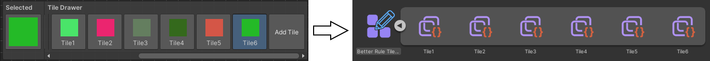
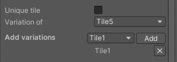
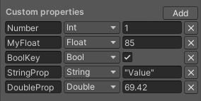
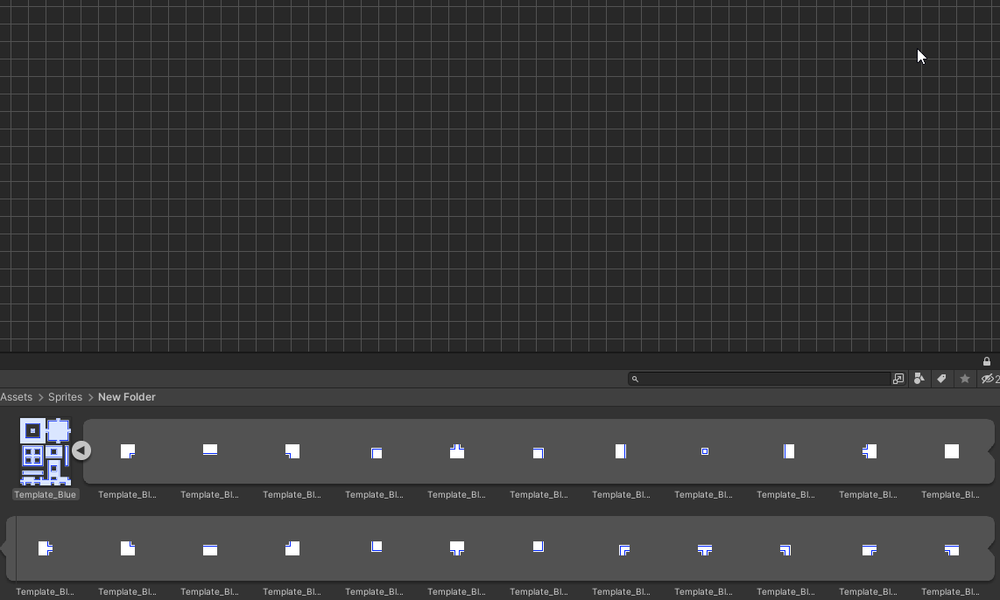
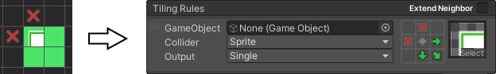
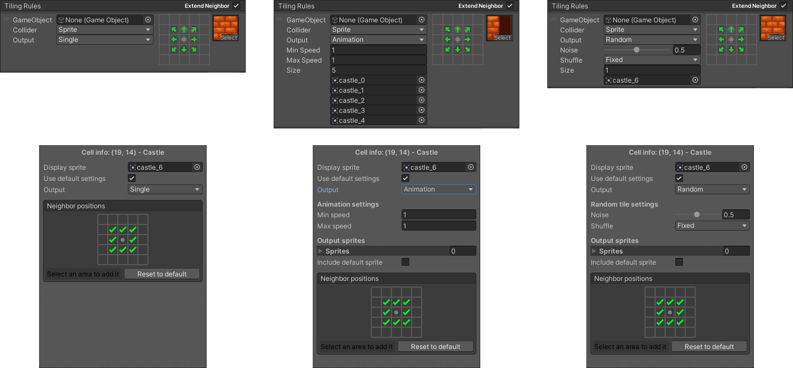

# <!-- {docsify-ignore} -->

# Creating a tile

To create a tile just head over to the [tile drawer](./better-rule-tiles/get-started?id=the-tile-drawer), and click the **Add Tile** button to create a tile. You can add any number of tiles, there's no limit on how much you can have. 
These tiles are basically the equivalent to creating a rule tile asset in the project window. When generating the tiles in the [export options](./better-rule-tiles/get-started?id=the-editor-settings) all of these tiles in the drawer will be converted to rule tiles that you can use in the game, with it's rules automatically set based on what you placed in the **editor grid**.

# The tile inspector

When selecting one of the tiles that you created in the drawer, an **inspector window** will appear in the bottom right corner of the editor, here you can change certain properties of the tile. Some settings are the same as in a regular rule tile, like the default sprite, collider or gameobject, but some options are more specific to these better rule tiles, and enable you to do things that the default rule tiles cannot.

> Note that you need to press the **apply changes** button to update the properties of the tiles, but deselecting the tile or selecting an another one will also save the changes.

## Editor options

In the editor options you can change how will the tile look in the editor:
- The **tile name** option will determine how your tile will be called in the editor, and in the project window after you've generated the tiles.
- The **tile image** option will determine how your tile will look after you've placed it down in the editor grid. 
  - This tile needs to be a separate image file, sliced sprites are not supported. 
  - This image has no effect on how the tile preview will look after you've generated the tiles, that is determined by the [default sprite](./better-rule-tiles/tile-creation?id=rule-tile-options) option
  - If you don't want to specify an image for the preview, you can set a preview in the [auto texture](./better-rule-tiles/tile-creation?id=auto-texture) options.

## Auto texture

The auto texture option lets you to specify a preview image without having to make your own image file. You can specify the color, the shape and the orientation of the image, so you can create a preview image for all of your tile types.

There are multiple shapes you can choose from
- Square
- 1x1 Slope
- 1x2 Slope bottom and top
- Diamond
- Isometric
- Hexagon pointed and flat topped
- Circle

You can also flip these textures in both orientations if you want a flipped variant, for example for a slope.

## Rule tile options

These options are the same as on a default rule tile:
- **Default sprite** - when no rules match the certain scenario, this sprite will be used instead.
- **Default collider** - the default collider of the tile.
- **Default gameobject** - the default gameobject of the tile.

## Unique tiles and tile variations

The editor allows you to set tiles to **unique** or **variations of another tile**. **Unique tiles** are the default ones, they connect to themselves when the rule is set to *this*, and they ignore all other tiles unless set to a rule like *any tile* or *empty*. If a tile is not unique, it is a **variation of another tile**, this tile being the **parent tile**, the tile which we specified in the option ***"Variation of"***. The **parent tile** connects to these tiles not only when the rule specifies, but as if it was the same tile as the parent. But these **variation tiles** do not connect to the **parent tiles** by default, to if the user wants them not to connect they can make it happen. If you want the **variation tiles** to connect to the parent in every case, not just the ones you specified, you can enable the **add missing rules** option in the [export settings](./better-rule-tiles/get-started?id=the-editor-settings). This option will find all the rules which are missing, and add them from the parent tile.

There's also an option to **add variation tiles manually**. The tile you're adding these tiles to will connect to all of the tiles you added, so you don't have to create separate rules if you want two or more tiles to connect to each other.

## Custom properties

If you need to, you can add **custom values and properties** to tiles. For example let's say you have different tiles you can walk on, you could specify a *walking speed multiplier* property, than in your game you could read that value in script to change the walking speed accordingly. You can set *int*, *float*, *double*, *char*, *string* and *bool* type properties. You can set a key and a value to it, using the key you can get the value of the property. 

To read more about the scripting part of this feature, go to the [c# reference](./better-rule-tiles/cs-reference).

# Adding sprites to the grid

To create [tiling rules](./better-rule-tiles/tile-creation?id=setting-tiling-rules) you need to add sprites to the grid first. To add sprites, you just simply **drag and drop** the sprites from the project window into the editor. You can select one or multiple sprites, but only if they're part of the same image file (sliced image). Dragging in multiple image files together is not supported, you have to do it one by one.

After you've added the sprites to the grid, you can use the [picker tool](./better-rule-tiles/get-started?id=toolbar) to select a sprite and the [brush tool](./better-rule-tiles/get-started?id=toolbar) to paint with it.

# Setting tiling rules

Setting rules is similar to setting them in the default rule tile, but instead of individually clicking each grid cell to cycle between the options, here you can just select the option than draw it on the grid. This way you can create rules way more faster than regular rule tiles. To place the rule ***"this"*** (which in a regular rule tile is the green arrow), you just need to draw the same tile next to one that has a sprite assigned, and if you want the rule ***"not this"*** (the red cross on the regular rule tile), you just draw with the tile **not same**. And to ignore the tile you just don't place anything there.

To find out more about the possibilities and get a more detailed explanation on how rules work you can go [here](./better-rule-tiles/rules).

# Individual tiling rule settings

Using the [tile inspector](./better-rule-tiles/get-started?id=toolbar) tool you can change how each rule behaves. When clicking on a tile while the [tile inspector](./better-rule-tiles/get-started?id=toolbar) tool is selected, the **inspector window** will show the info of the selected grid cell. In this window you can change everything you can in the base **tiling rules**. You can change what neighbors to check for, you can set the sprite to be random or animated, you can change the collider type and change the attached gameobject.

Some differences between the default and the editor tiling rules:
- In the editor settings, the neighbor positions only determines if that place is gonna get checked when generating the tile or not. You can easily specify a larger area by selecting an area around the tile than clicking the **add selection** button, this option dynamically enables the positions relative to the tile. You can reset the positions by clicking the reset button. 
- In the output sprites there's a toggle to **include default sprite**. When using a random or animated it ignores the default tile and only adds the tiles in the array, enabling this option will also add the default tile to the front of the array.