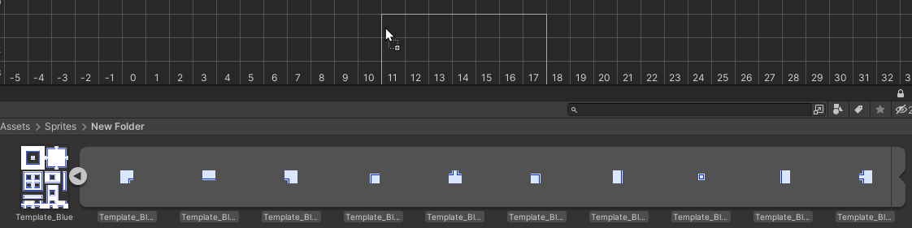

# <!-- {docsify-ignore} -->

# Creating a tile

To create a tile just head over to the [tile drawer](./better-rule-tiles/get-started?id=the-tile-drawer), and click the **Add Tile** button to create a tile. You can add any number of tiles, there's no limit on how much you can have. 
These tiles are basically the equivalent to creating a rule tile asset in the project window. When generating the tiles in the [export options](./better-rule-tiles/get-started?id=the-editor-settings) all of these tiles in the drawer will be converted to rule tiles that you can use in the game, with it's rules automatically set based on what you placed in the **editor grid**.

# The tile inspector

When selecting one of the tiles that you created in the drawer, an **inspector window** will appear in the bottom right corner of the editor, here you can change certain properties of the tile. Some settings are the same as in a regular rule tile, like the default sprite, collider or gameobject, but some options are more specific to these better rule tiles, and enable you to do things that the default rule tiles cannot.

> Note that you need to press the **apply changes** button to update the properties of the tiles, but deselecting the tile or selecting an another one will also save the changes.

## Editor options

In the editor options you can change how will the tile look in the editor:
- The **tile name** option will determine how your tile will be called in the editor, and in the project window after you've generated the tiles.
- The **tile image** option will determine how your tile will look after you've placed it down in the editor grid. 
  - This tile needs to be a separate image file, sliced sprites are not supported. 
  - This image has no effect on how the tile preview will look after you've generated the tiles, that is determined by the [default sprite](./better-rule-tiles/tile-creation?id=rule-tile-options) option
  - If you don't want to specify an image for the preview, you can set a preview in the [auto texture](./better-rule-tiles/tile-creation?id=auto-texture) options.

## Auto texture

The auto texture option lets you to specify a preview image without having to make your own image file. You can specify the color, the shape and the orientation of the image, so you can create a preview image for all of your tile types.

There are multiple shapes you can choose from
- Square
- 1x1 Slope
- 1x2 Slope bottom and top
- Diamond
- Isometric
- Hexagon pointed and flat topped
- Circle

You can also flip these textures in both orientations if you want a flipped variant, for example for a slope.

## Rule tile options

## Unique tiles and tile variations

## Custom properties

# Adding sprites to the grid

To create [tiling rules](./better-rule-tiles/tile-creation?id=setting-tiling-rules) you need to add sprites to the grid first. To add sprites, you just simply **drag and drop** the sprites from the project window into the editor. You can select one or multiple sprites, but only if they're part of the same image file (sliced image). Dragging in multiple image files together is not supported, you have to do it one by one.

# Setting tiling rules

Setting rules is similar to setting them in the default rule tile, but instead of individually clicking each grid cell to cycle between the options, here you can just select the option than draw it on the grid. This way you can create rules way more faster than regular rule tiles. To place the rule ***"this"*** (which in a regular rule tile is the green arrow), you just need to draw the same tile next to one that has a sprite assigned, and if you want the rule ***"not this"*** (the red cross on the regular rule tile), you just draw with the tile **not same**. And to ignore the tile you just don't place anything there.

To find out more about the possibilities and get a more detailed explanation on how rules work you can go [here](./better-rule-tiles/rules).

# Individual tiling rule settings

Using the [tile inspector](./better-rule-tiles/get-started?id=toolbar) tool you can change how 