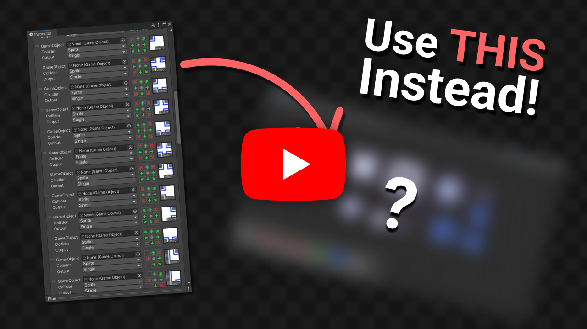

# <!-- {docsify-ignore} -->

# Introducing the tool

## Chapter: "Intro"

If you've ever used rule tiles in Unity you know how time consuming and tedious can it be just to convert a single tileset into a rule tile. And sometimes it doesn't even have all the features you'd need for your game, so you just end up spending even more time working around those problems. Well... don't you worry, because I have the perfect solution for it!

I call it **"Better rule tiles"**, it's a package that adds a tilemap style editor that lets you create rule tiles in it. Using this tool you can create rule tiles significantly faster than doing it the regular way, and there are also a number of features which are not present in the default editor. For example this tool lets you create interactions between tiles, and adds more default rules to choose from.

## Chapter: "Installing the package"

But let's start by installing the package to your project. To get the package head to the project's itch page where you can download the package. There are two versions, the full version is paid, but there's a demo so you can try out the package and decide whether it's worth it for you or not.

After you've dowloaded the package, you need to add it to your project. It comes in a zip file so first you need to unpack it, after that you can place the unpacked folder in either the **"assets"**, or the **"packages"** folder of your project. I recommend adding it to the packages so it doesn't take up space next to your assets. After this is done you can start using the asset.

## Chapter: "Getting started"

To open the editor you first have to create a **"Better rule tile container"** asset. You can find this in the create asset menu at **"Create/2D/Tiles/"**. This asset is the heart of the editor, this stores all the data of to the editor, and after you're done and generated the tiles, they'll also be stored in this asset. You can create as many containers as you want and they'll each have their own editor, so you can edit multiple tilemaps simultaniously.

## The rest of the video